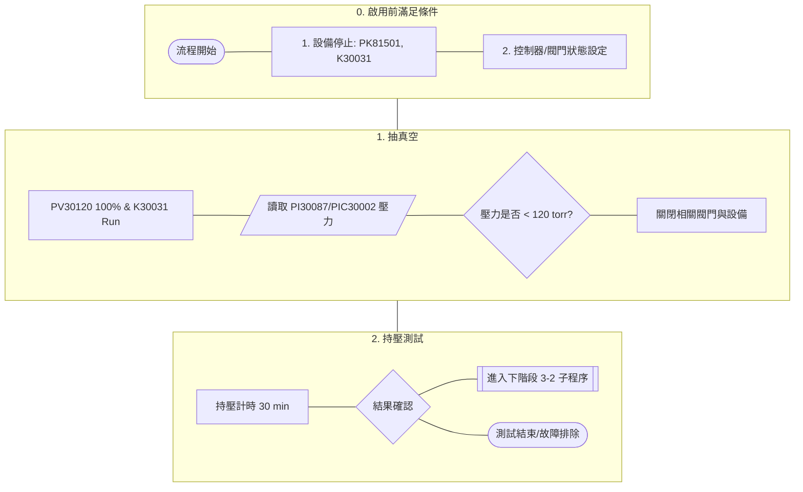

```mermaid
graph TD
    %% 階段 0：使用矩形代表設定過程
    subgraph Stage0 [0. 啟用前滿足條件]
        A([流程開始]) --- B[1. 設備停止: PK81501, K30031]
        B --- C[2. 控制器/閥門狀態設定]
    end

    Stage0 --- Stage1

    %% 階段 1：使用平行四邊形讀值 + 菱形判斷
    subgraph Stage1 [1. 抽真空]
        E[PV30120 100% &amp; K30031 Run] --- F[/讀取 PI30087/PIC30002 壓力/]
        F --- G{壓力是否 &lt; 120 torr?}
        G --- H[關閉相關閥門與設備]
    end

    Stage1 --- Stage2

    %% 階段 2：使用雙邊矩形代表轉向其他 SOP
    subgraph Stage2 [2. 持壓測試]
        I[持壓計時 30 min] --- J{結果確認}
        J --- K[[進入下階段 3-2 子程序]]
        J --- L([測試結束/故障排除])
    end
```
